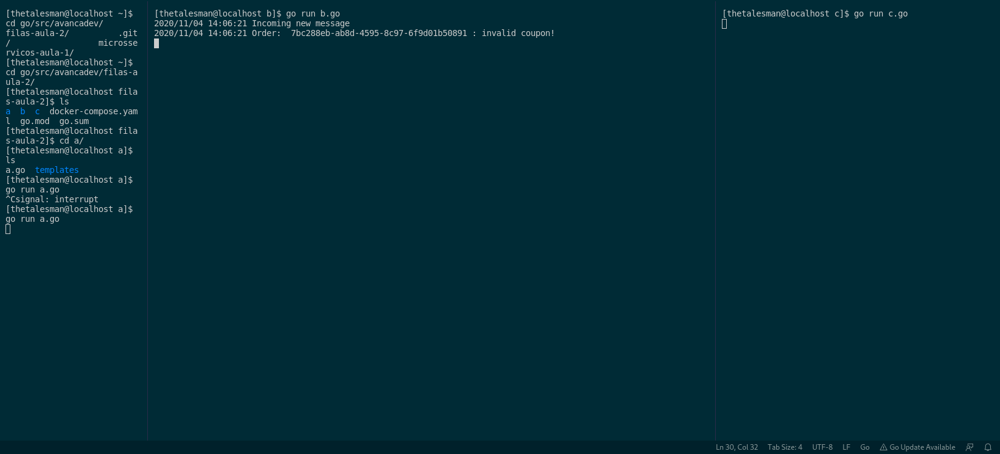
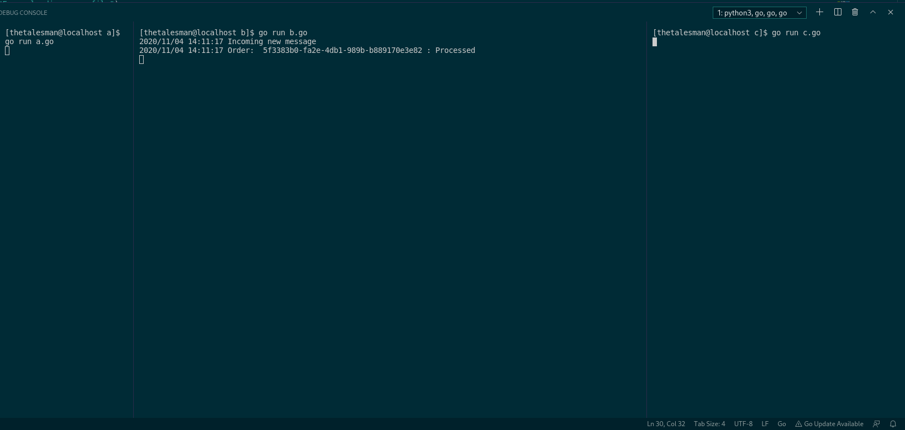
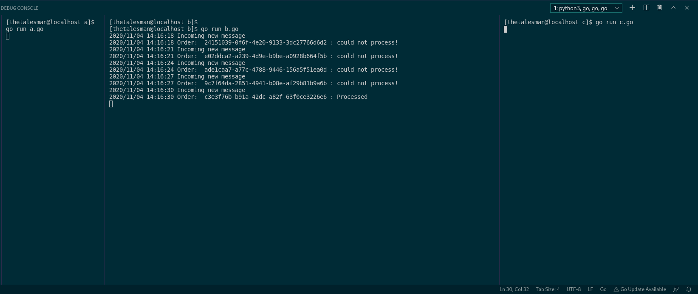

## This is a showcase of RabbitMQ on go microsservices

### Invalid Coupon error caught on service B

### Processed msg caught on service B

### Failed processing because service C was offline and then Processed msg caught on service B
